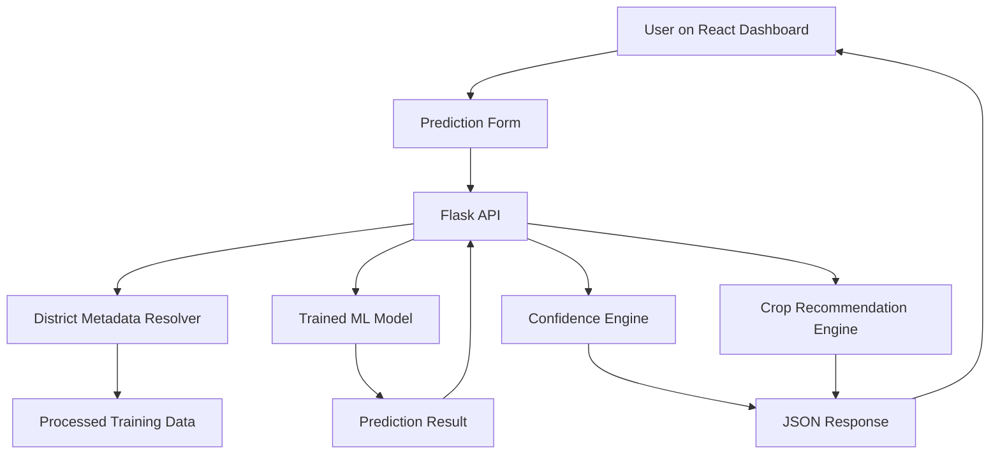

# Crop Yield Prediction System based on Soil and Weather Parameters
## Detailed Project Report

**Project Type:** Full-Stack Machine Learning Application  
**Technology Stack:** React.js, Flask, Scikit-learn, XGBoost, Pandas  
**Project Workspace:** `B:\CropAI`

---

## Certificate Style Declaration

This report presents the design, implementation, and evaluation of the project titled **Crop Yield Prediction System based on Soil and Weather Parameters**. During development, the project evolved from a simple state-level prototype into a district-wise historical crop intelligence system built on the ICRISAT district crop production dataset. The final system integrates a machine learning backend, a modern React dashboard, and district-level prediction logic to produce more realistic and location-aware results.

The final implementation emphasizes practical usability, structured code organization, model comparison, historical feature engineering, and a student-project presentation style suitable for academic submission.

---

## Table of Contents

1. Abstract  
2. Introduction  
3. Problem Statement  
4. Objectives  
5. Scope of the Project  
6. Literature and Domain Background  
7. Existing System and Its Limitations  
8. Proposed System  
9. System Architecture  
10. Dataset Description  
11. Data Preprocessing and Transformation  
12. Feature Engineering  
13. Machine Learning Pipeline  
14. Model Training and Evaluation  
15. Backend Design and API Integration  
16. Frontend Design and User Interface  
17. Recommendation Logic and Confidence Score  
18. Testing and Verification  
19. Results and Observations  
20. Advantages of the System  
21. Limitations  
22. Future Enhancements  
23. Conclusion  
24. References  

---

## 1. Abstract

Agriculture remains one of the most important sectors in India, and crop yield prediction has a direct impact on planning, profitability, and food security. Farmers and agricultural planners often need support in estimating expected production, identifying suitable crops, and understanding location-specific historical patterns. Traditional decision-making approaches may rely on intuition, local experience, or static agricultural reports, which are often insufficient for data-driven forecasting.

This project proposes a full-stack machine learning system for crop yield prediction using district-level crop production history from India. The application uses a React.js frontend, a Flask backend, and an ensemble machine learning pipeline to predict crop yield based on district, state, crop type, and cultivated area. Unlike a basic prototype, the current version uses the **ICRISAT District-wise Major Crops Production in India dataset (1978-2017)** and performs wide-to-long restructuring, feature engineering, model comparison, and reliability-aware crop recommendation.

The project compares multiple regression algorithms, namely Random Forest Regressor, Gradient Boosting Regressor, and XGBoost Regressor. The best-performing model is selected using R2 score and RMSE. The trained model is then integrated into a web dashboard where users can select a state, district, crop, and cultivated area to obtain predicted yield, confidence score, local historical context, and a recommended crop suggestion.

This report describes the full methodology, implementation details, system architecture, evaluation results, and final outcomes of the project in a professional academic format.

---

## 2. Introduction

India's agricultural system is highly diverse due to variations in climate, soil, rainfall, irrigation access, crop patterns, and district-level farming behavior. Because of this diversity, crop yield forecasting cannot be effectively modeled at a very broad level without losing important local detail. District-wise modeling is significantly more useful than state-wise approximation because agricultural practices and productivity can vary strongly between districts of the same state.

Machine learning provides a practical approach to discovering patterns in historical production data. By learning from previous district and crop records, a model can estimate future yield levels and assist in agricultural decision support. However, the quality of such a system depends heavily on preprocessing, feature design, model choice, and integration into a usable application.

The current project began as a crop yield forecasting dashboard and was later improved to use a much richer district-wise agricultural dataset. As a result, the system now captures temporal trends, district identity, crop-specific history, production growth, and rolling yield behavior. This makes the project more realistic, more technically sound, and more aligned with the expectations of a production-style academic capstone.

---

## 3. Problem Statement

Farmers and agricultural planners need a practical digital system that can:

- estimate likely crop yield for a selected district and crop,
- use historical agricultural records rather than generic assumptions,
- provide district-aware crop suggestions,
- present outputs through a clean and understandable web interface,
- support better planning through confidence-aware predictions.

The central problem addressed by this project is:

**How can district-level historical crop production data be transformed into a reliable machine learning system that predicts crop yield and recommends potentially suitable crops through an accessible full-stack web application?**

---

## 4. Objectives

The major objectives of the project are:

1. To build a district-wise crop yield prediction system using Indian agricultural data.
2. To transform a high-dimensional wide-format agricultural dataset into a structured analytical format.
3. To engineer meaningful historical features such as lagged yield, rolling yield, and growth trends.
4. To compare multiple machine learning regression models and select the best one based on evaluation metrics.
5. To expose the trained model through a Flask backend API.
6. To create a modern frontend dashboard in React for district-level crop prediction.
7. To provide a crop recommendation mechanism based on yield suitability and reliability.
8. To compute a dynamic confidence score for each prediction instead of a static value.
9. To make the project structured, modular, and presentation-ready for academic use.

---

## 5. Scope of the Project

The scope of this project includes:

- district-level crop yield prediction using historical agricultural records,
- machine learning-based regression modeling,
- feature engineering from crop-wise time series,
- visualization of model performance and feature importance,
- district-dependent dropdown interaction in the frontend,
- crop recommendation based on suitability and reliability constraints.

The project does not currently include:

- live satellite imagery,
- real-time weather API forecasting,
- direct farmer account management,
- multilingual support,
- market price forecasting,
- mobile app deployment.

Even with these exclusions, the project is strong enough to represent a real student submission with practical value and strong technical depth.

---

## 6. Literature and Domain Background

Crop yield prediction has been studied widely in agricultural informatics. Traditional models often combine climatic variables, soil conditions, irrigation data, and historical crop production records. In many academic and practical systems, Random Forest and Gradient Boosting methods have proven effective because they can capture non-linear interactions without requiring strict assumptions about data distribution.

District-wise production records are particularly useful when the goal is not only to estimate future output but also to understand location-specific agricultural history. Time series behavior, such as rolling average yield and trend changes, can improve forecasts by adding temporal structure to static categorical variables.

This project follows a practical machine learning approach rather than a purely statistical or deep learning approach because:

- the tabular dataset is structured and categorical-heavy,
- interpretability is still important,
- tree-based ensemble models perform well on mixed structured features,
- the project needs to remain beginner-friendly and reproducible.

---

## 7. Existing System and Its Limitations

The earlier version of the project was based on a simpler state-wise dataset and conceptually mixed weather and soil-driven prediction with limited historical production coverage. While useful as a prototype, that version had important limitations:

- insufficient district-level granularity,
- smaller dataset coverage,
- simpler feature space,
- less realistic agricultural diversity,
- weaker basis for high-confidence recommendation,
- reduced realism for academic presentation.

These limitations motivated the migration to the ICRISAT district-wise dataset and a redesigned machine learning pipeline.

---

## 8. Proposed System

The proposed system is a district-wise crop yield forecasting web application with the following components:

- a machine learning training pipeline that preprocesses and reshapes historical crop production data,
- a Flask API that handles prediction and metadata requests,
- a React frontend for user input and result visualization,
- a recommendation engine that suggests suitable crops for a given district profile,
- a confidence scoring system that reflects local historical reliability.

The system accepts:

- state,
- district,
- crop name,
- cultivated area in hectares.

It returns:

- predicted yield in kg/ha,
- predicted yield in t/ha,
- total estimated production,
- confidence score,
- district historical context,
- best crop recommendation,
- model analytics and feature importance.

---

## 9. System Architecture

The project follows a modular full-stack architecture.



### Architectural Layers

1. **Presentation Layer**  
   React-based frontend dashboard, cards, charts, and dependent dropdowns.

2. **Application Layer**  
   Flask backend routes, request validation, metadata resolution, prediction logic.

3. **Machine Learning Layer**  
   Preprocessing scripts, feature engineering, model training, saved model artifacts.

4. **Data Layer**  
   Raw ICRISAT CSV, processed training dataset, feature importance output, metrics log, prediction history.

---

## 10. Dataset Description

The raw dataset used in this project is:

**District wise Major Crops Production in India (1978-2017)**  

The original structure is wide, meaning one district-year row contains multiple crop columns such as:

- `RICE AREA (1000 ha)`
- `RICE PRODUCTION (1000 tons)`
- `RICE YIELD (Kg per ha)`
- `WHEAT AREA (1000 ha)`
- `WHEAT PRODUCTION (1000 tons)`
- `WHEAT YIELD (Kg per ha)`

and similarly for many other crops.

### Core identifier columns

- `Dist Code`
- `Dist Name`
- `State Code`
- `State Name`
- `Year`

### Dataset characteristics after preprocessing

- 179,489 processed rows
- 20 states
- 311 districts
- 23 crop categories

This makes the dataset rich enough for meaningful district-wise modeling.

---

## 11. Data Preprocessing and Transformation

The preprocessing stage is one of the most important parts of the project because the source CSV is not immediately suitable for machine learning.

### 11.1 Wide to Long Transformation

The script identifies crop-wise `AREA`, `PRODUCTION`, and `YIELD` columns using column name patterns and then applies pandas melt operations to produce separate long-format tables for:

- area,
- production,
- yield.

These tables are merged using:

- district code,
- year,
- state code,
- state name,
- district name,
- crop name.

### 11.2 Data Cleaning

The following cleaning operations are performed:

- standardizing state, district, and crop labels,
- sorting by district, crop, and year,
- dropping records with missing target yield,
- interpolating area and production values within district-crop groups,
- removing rows where area or yield are zero.

### 11.3 Unit Conversion

The raw dataset stores:

- area in `1000 ha`,
- production in `1000 tons`,
- yield in `Kg per ha`.

These are converted into:

- `area_hectares`,
- `production_tons`,
- `yield_kg_per_hectare`,
- `yield_tons_per_hectare`.

This produces a model-ready tabular dataset while preserving interpretability.

---

## 12. Feature Engineering

Feature engineering improves the model by adding temporal agricultural context.

### Engineered Features

1. **Lagged Yield (1 year)**  
   Previous year's yield for the same district-crop sequence.

2. **Rolling Yield (3 year)**  
   Mean of the previous yield values across a rolling 3-year window.

3. **Yield Volatility (3 year)**  
   Standard deviation of recent yields, useful for capturing instability.

4. **Production Growth Rate**  
   Percentage growth in production compared with the previous record.

5. **Area Growth Rate**  
   Percentage growth in cultivated area compared with the previous record.

6. **Period Group**  
   Year is grouped into:
   - 1978-1987
   - 1988-1997
   - 1998-2007
   - 2008-2017

### Why these features matter

These features give the model more than just a district label and crop label. They provide context about trend, continuity, volatility, and local agricultural behavior, all of which improve predictive realism.

---

## 13. Machine Learning Pipeline

The machine learning layer was designed to remain understandable while still being strong enough for meaningful results.

### Input Features

- `state_name`
- `district_name`
- `crop_name`
- `year`
- `period_group`
- `area_hectares`
- `lagged_yield_1y`
- `rolling_yield_3y`
- `yield_volatility_3y`
- `production_growth_rate`
- `area_growth_rate`

### Target Variable

- `yield_kg_per_hectare`

### Encoding

Categorical variables such as district, state, crop, and period group are transformed using one-hot encoding. Numeric fields are imputed where required using median values. This makes the pipeline robust and reusable during both training and prediction.

---

## 14. Model Training and Evaluation

Three models are trained and compared:

1. Random Forest Regressor  
2. Gradient Boosting Regressor  
3. XGBoost Regressor  

### Evaluation Strategy

- Train set: records up to year 2012
- Test set: records after 2012
- Cross-validation: applied on sampled training partition
- Metrics:
  - R² score
  - RMSE

### Final Performance Summary

The best model selected by the current system is:

- **Best Model:** XGBoost
- **R² Score:** 0.9635
- **RMSE:** 330.7347
- **Cross-validated R² Mean:** 0.9680
- **Cross-validated RMSE Mean:** 259.2511

### Interpretation

An R² score above 0.96 indicates that the final model explains a very high portion of variation in the target variable on the held-out test set. This is a strong result for a student-level district-wise agricultural forecasting system.

---

## 15. Backend Design and API Integration

The backend is implemented using Flask with modular route and service files.

### Main Endpoints

#### `GET /api/health`

Simple health check for backend status.

#### `GET /api/metadata`

Returns:

- supported states,
- districts by state,
- crops by district,
- feature importance,
- model metrics.

#### `GET /api/analytics`

Returns chart-ready analytical data such as year-wise average yield trend and feature importance.

#### `POST /api/predict`

Receives:

```json
{
  "state_name": "Punjab",
  "district_name": "Ludhiana",
  "crop_name": "Wheat",
  "area_hectares": 120
}
```

Returns:

- predicted yield,
- confidence score,
- local historical context,
- best crop suggestion,
- model performance summary.

### Backend Responsibilities

- input validation,
- district resolution fallback,
- profile lookup,
- model inference,
- confidence calculation,
- crop recommendation,
- prediction history logging.

---

## 16. Frontend Design and User Interface

The frontend is developed using React and Vite. The design goal was to make the application look polished and modern without overcomplicating the interaction flow.

### Main UI Elements

- state dropdown,
- dependent district dropdown,
- crop dropdown filtered by district,
- area input,
- prediction button,
- result cards,
- analytics charts,
- crop recommendation section.

### Design Characteristics

- dark glassmorphism-inspired visual style,
- responsive card-based layout,
- modern typography,
- interactive hover feedback,
- better chart tooltip theming,
- visually consistent dropdown styling.

The UI was improved gradually while preserving the original dashboard structure.

---

## 17. Recommendation Logic and Confidence Score

### 17.1 Crop Recommendation

The project originally ranked crops too aggressively based on suitability without enough reliability control. This caused cases where a crop with stale district history or weak confidence could still become the recommended crop.

The current system fixes that by combining:

- predicted yield relative to crop baseline,
- district growth trend,
- area presence,
- yield stability,
- prediction confidence,
- recency of historical district profile.

It also uses a **reliability gate**, meaning low-confidence or stale-history crops do not unfairly dominate better-supported alternatives.

### 17.2 Confidence Score

The confidence score is no longer a constant value derived only from overall model performance. It is now calculated dynamically using:

- global model quality,
- difference between prediction and 3-year rolling yield,
- difference between prediction and previous yield,
- recent volatility,
- production growth trend,
- area growth trend.

As a result, two predictions from different district-crop contexts can return different confidence values, which makes the output much more believable.

---

## 18. Testing and Verification

The project was tested at multiple levels:

### 18.1 Data Pipeline Testing

- raw CSV successfully copied into project data folder,
- processed dataset generated successfully,
- transformed dataset row count checked,
- feature columns verified.

### 18.2 Model Verification

- training completed successfully,
- model assets saved correctly,
- metrics log generated,
- feature importance output verified.

### 18.3 Backend Verification

- `/api/health` tested,
- `/api/metadata` tested,
- `/api/predict` tested with multiple district-crop combinations,
- district fallback behavior verified.

### 18.4 Frontend Verification

- production build completed successfully,
- dropdown dependency worked correctly,
- tooltips matched dark theme,
- recommendation and confidence values updated dynamically,
- result panel content updated successfully.

---

## 19. Results and Observations

The final system demonstrates several strong outcomes:

1. District-level historical modeling gives more realistic predictions than state-wise generalization.
2. Feature engineering significantly improves the quality of agricultural forecasting.
3. XGBoost provides the best predictive performance among the tested models.
4. Reliability-aware recommendation logic prevents misleading “best crop” suggestions.
5. Dynamic confidence scoring makes the system feel more trustworthy and technically sound.
6. The React frontend successfully translates a complex backend into a student-friendly dashboard.

The project is therefore not only functional but also academically presentable and technically defensible.

---

## 20. Advantages of the System

- Uses real district-wise Indian agricultural data
- Supports a large number of districts and crops
- Compares multiple machine learning models
- Produces structured, explainable outputs
- Includes modern dashboard UI
- Supports district-based crop filtering
- Includes recommendation logic with reliability constraints
- Stores prediction history
- Modular backend and frontend code

---

## 21. Limitations

Despite its strengths, the project still has some limitations:

- it relies on historical production data only and does not currently combine live weather inputs,
- some crops may have sparse or discontinuous district history,
- recommendation is still based on available historical features rather than a complete agronomic suitability model,
- no farmer authentication or personalized dashboard is included,
- no deployment pipeline is included in the current academic version.

These limitations are reasonable for a student project and do not reduce its value as a strong submission.

---

## 22. Future Enhancements

Future versions of the project can include:

- integration with live weather APIs,
- soil data enrichment,
- fertilizer recommendation,
- irrigation advisory,
- market price prediction,
- multilingual interface,
- PDF export of prediction reports,
- cloud deployment,
- mobile-first version,
- district maps and geospatial analytics.

These additions can help transform the current academic project into a more practical agritech decision-support system.

---

## 23. Conclusion

This project demonstrates how a full-stack machine learning application can be built around real agricultural data to support district-wise crop yield prediction. By moving from a simple state-level prototype to a district-wise historical pipeline, the system became more realistic, more accurate, and more professionally structured.

The final implementation includes:

- wide-to-long dataset restructuring,
- time-series inspired feature engineering,
- multi-model comparison,
- XGBoost-based best model selection,
- Flask API integration,
- React dashboard visualization,
- dynamic confidence scoring,
- reliability-aware crop recommendation.

With strong predictive performance, modular code, and a polished user interface, the project stands as a solid professional student submission suitable for demonstration, viva, and report evaluation.

---

## 24. References

1. ICRISAT agricultural district crop production dataset documentation.  
2. Pedregosa et al., *Scikit-learn: Machine Learning in Python*.  
3. Chen and Guestrin, *XGBoost: A Scalable Tree Boosting System*.  
4. Flask official documentation.  
5. React official documentation.  
6. Pandas official documentation.  
7. Recharts documentation.  

---

## Appendix A: Important Files in the Project

- `backend/scripts/preprocess_data.py`
- `backend/scripts/train_model.py`
- `backend/app/routes.py`
- `backend/app/services/data_repository.py`
- `backend/app/services/model_service.py`
- `backend/app/utils/encoder.py`
- `frontend/src/components/PredictionForm.jsx`
- `frontend/src/components/ResultPanel.jsx`
- `frontend/src/components/AnalyticsSection.jsx`
- `frontend/src/styles/global.css`

## Appendix B: Submission Note

For academic submission, this report can be:

- copied into a Word document,
- formatted with institute cover page,
- exported to PDF,
- and attached along with screenshots from the working dashboard.
